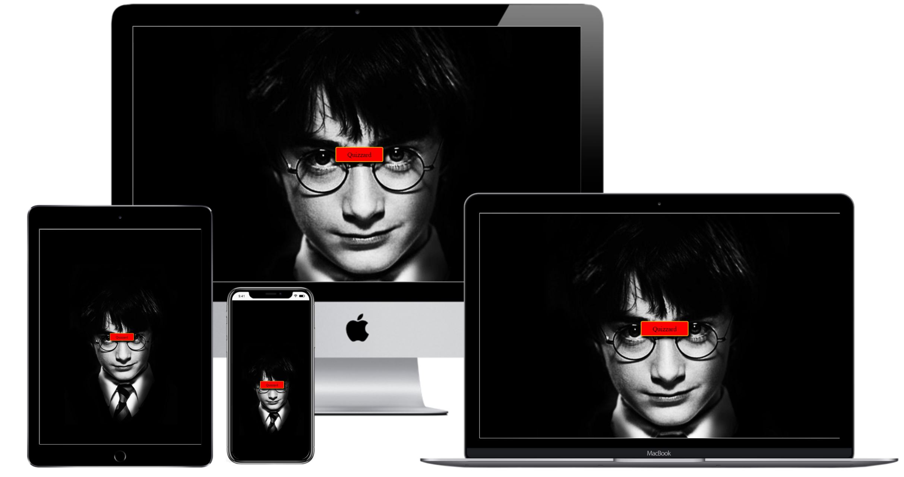

# Quizzard Trivia

## Introduction
Quizzard Trivia is a web based application designed using Java Script. Quizzard Trivia is the ultimate fun quiz that has been specifically designed for the ultimate Harry Potter fan also known as "Potterheads". The quiz consists of 30 hard questions that are based from the books and films. This quiz will test their knowledge and push their limits on how much that they really know about Harry Potter.

[View the live project here.](https://joycey83.github.io/Quizzard-Trivia/)

My approach for designing this quiz game application was to create it being mobile responsive first and for the game being accessible and easily played on through a range of different devices.

