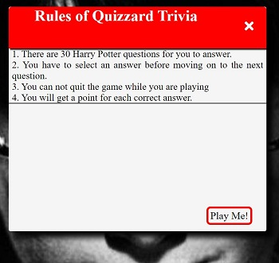

# Quizzard Trivia

## Introduction
Quizzard Trivia is a web based application designed using Java Script. Quizzard Trivia is the ultimate fun quiz that has been specifically designed for the ultimate Harry Potter fan also known as "Potterheads". The quiz consists of 30 hard questions that are based from the books and films. This quiz will test their knowledge and push their limits on how much that they really know about Harry Potter.

[View the live project here.](https://joycey83.github.io/Quizzard-Trivia/)

My approach for designing this quiz game application was to create it being mobile responsive first and for the game being accessible and easily played on through a range of different devices.

---
# Target Audience

Since readers young and old were first introduced to the 'boy who lived' -under the stairs at 4 Privet Drive -  fans have been spoilt with seven books and eight films.

It has since become one of the world's most-loved fictional worlds with grown adults still awaiting their letter from Hogwarts.

Many of us grew up alongside Harry, Ron and Hermione, glued to the books and eagerly awaiting the cinema releases, while younger generations are only just discovering the magical world beyond Platform 9 3/4.

Most of us will have seen every movie multiple times like me, and we all know someone who thinks they’re a Potter expert.

The quiz was designed in the mind for massive Harry Potter fans who are part of the worldwide fandom community.

The game hopes to attract 3 main types of players/users

1. Players who are massive Harry potter fans who are known as "Potterheads" in the fandom community.
2. Players who relatively new to Harry Potter and has just read all the books or watched the films. They just want to test their knowledge on how much they know so far.
3. Players who enjoyed reading the books and watching the films but they aren't considered fans but they will like to take up the challenge and test their Harry Potter knowledge.

---
# Goals
 - Create the ultimate fun and interactive quiz that the fans of the Harry Potter franchise will enjoy playing.
 - Design a quiz that is asthetically pleasing and in theme for the player.
 - To make the quiz very challenging so that it will test the fans knowlege to the limit.
 - Design the quiz so that it is responsive across all mobile and tablet devices.

 ## Achievement of these goals
 - Used Java Script to create a quiz based on Harry Potter book series and film series.
 - Used HTML to structure the layout of the quiz.
 - Used CSS to design a Harry Potter themed quiz that is asthetically pleasing on the eye for the player.
 - Tested the quiz with friends and fans of the Harry Potter book and film series.

 ----
 # User Experience (UX)

* ## User Stories
  * As a user, I would want to be able to see my scores.
  * As a user, I would like to be able to see how many questions that I have got right or wrong at the end of the quiz.
  * As a user, I would like to play the game again once the quiz has ended.

  ---
  # Design

  + ## Colour Scheme
   The colours that are choosen are predominantly made up of different variations of red,white,blue, green and gold. This colour scheme was choosen because they are the from the 4 house colours of the Harry Potter book series.Colours was only taken from 3 out of the 4 House colours from Harry Potter because Yellow and Brown will ruin the design flow of the whole quiz game. Other

| Color                    | Hex                                                                |
| ------------------------ | ------------------------------------------------------------------ |
| Dark Slate Blue     |     #333399  |
| Black Panther Gray  |     #424242  |
| Red                 |     #92011a  |
| Red                 |     #FF0000  |
| Black               |     #191919  |
| black               |     #252525  |
| Cornsilk            |     #FFF8DC  |
| White               |     #FFFFFF  |
| Whitesmoke          |     #f5f5f5  |
| Light Grey          |     #d3d3d3 |
| Goldenrod           |     #daa520 |
| Gold                |     #ffd700 |
| Colbalt Blue        |     #0047ab |
| Green               |     #008000 |
| Orange              |     #ffa500 |

+ ## Typography
The Roboto font is the only font that is being used throughout the whole game application with Sans Serif as the fallback font in case for any reason the font isn't being imported into the site correctly. Roboto was choosen because the font has a clean,sleek look and has a high readability on the application for the players.

+ ## Imagery
Through out the quiz game application 3 Harry Potter themed imagery was used. They were chosen to envoke an nostalgic response for different generations of Harry Potter fans. When users see the images from Harry Potter they will instinctively know that they will be playing a Harry Potter quiz game without pressing play.

+ ## Wireframes

  * Desktop
  [View Desktop Wireframes](assets/images/desktop-wireframes.jpg)
  * Tablet
  [View Tablet Wireframes](assets/images/tablet-wireframes.jpg)
  * Mobile
  [View Mobile Wireframes](assets/images/mobile-wireframes.jpg)

---
# Features
## Existing Features

* **Home Page**
  * Quizzard button
  This page contains a straight forward singular button with the word "Quizzard". The button, when pressed should direct them to the next step of the application. This should be very self expanatory for the player so no instructions needed to tell them what they should do when they see a button in the middle of the screen

  
  * Instructions Box
  When the player/user clicks onto the quizzard button this will then direct them to a set of simple instructions on many questions the quiz consists of and how to play the game. We can not assume that everyone has played a quiz before, and that they are familar with the format. Instructions of the game will be provided as with any web based game application.
  

* **Quiz Game Page**
  
  

 

