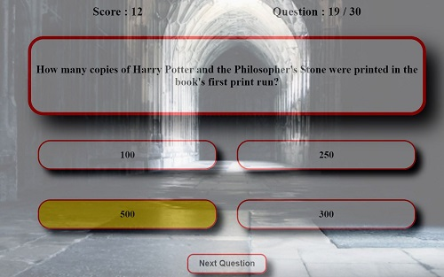

# Quizzard Trivia

## Introduction
Quizzard Trivia is a web based application designed using Java Script. Quizzard Trivia is the ultimate fun quiz that has been specifically designed for the ultimate Harry Potter fan also known as "Potterheads". The quiz consists of 30 hard questions that are based from the books and films. This quiz will test their knowledge and push their limits on how much that they really know about Harry Potter.

[View the live project here.](https://joycey83.github.io/Quizzard-Trivia/)

My approach for designing this quiz game application was to create it being mobile responsive first and for the game being accessible and easily played on through a range of different devices.

---
# Target Audience

Since readers young and old were first introduced to the 'boy who lived' -under the stairs at 4 Privet Drive -  fans have been spoilt with seven books and eight films.

It has since become one of the world's most-loved fictional worlds with grown adults still awaiting their letter from Hogwarts.

Many of us grew up alongside Harry, Ron and Hermione, glued to the books and eagerly awaiting the cinema releases, while younger generations are only just discovering the magical world beyond Platform 9 3/4.

Most of us will have seen every movie multiple times like me, and we all know someone who thinks they’re a Potter expert.

The quiz was designed in the mind for massive Harry Potter fans who are part of the worldwide fandom community.

The game hopes to attract 3 main types of players/users

1. Players who are massive Harry potter fans who are known as "Potterheads" in the fandom community.
2. Players who relatively new to Harry Potter and has just read all the books or watched the films. They just want to test their knowledge on how much they know so far.
3. Players who enjoyed reading the books and watching the films but they aren't considered fans but they will like to take up the challenge and test their Harry Potter knowledge.

---
# Goals
 - Create the ultimate fun and interactive quiz that the fans of the Harry Potter franchise will enjoy playing.
 - Design a quiz that is asthetically pleasing and in theme for the player.
 - To make the quiz very challenging so that it will test the fans knowlege to the limit.
 - Design the quiz so that it is responsive across all mobile and tablet devices.

 ## Achievement of these goals
 - Used Java Script to create a quiz based on Harry Potter book series and film series.
 - Used HTML to structure the layout of the quiz.
 - Used CSS to design a Harry Potter themed quiz that is asthetically pleasing on the eye for the player.
 - Tested the quiz with friends and fans of the Harry Potter book and film series.

 ----
 # User Experience (UX)

* ## User Stories
  * As a user, I would want to be able to see my scores.
  * As a user, I would like to be able to see how many questions that I have got right or wrong at the end of the quiz.
  * As a user, I would like to play the game again once the quiz has ended.

  ---
  # Design

  + ## Colour Scheme
   The colours that are choosen are predominantly made up of different variations of red,white,blue, green and gold. This colour scheme was choosen because they are the from the 4 house colours of the Harry Potter book series.Colours was only taken from 3 out of the 4 House colours from Harry Potter because Yellow and Brown will ruin the design flow of the whole quiz game. The other colour that was also used was Orange.

| Color                    | Hex                                                                |
| ------------------------ | ------------------------------------------------------------------ |
| Dark Slate Blue     |     #333399  |
| Black Panther Gray  |     #424242  |
| Red                 |     #92011a  |
| Red                 |     #FF0000  |
| Black               |     #191919  |
| black               |     #252525  |
| Cornsilk            |     #FFF8DC  |
| White               |     #FFFFFF  |
| Whitesmoke          |     #f5f5f5  |
| Light Grey          |     #d3d3d3 |
| Goldenrod           |     #daa520 |
| Gold                |     #ffd700 |
| Colbalt Blue        |     #0047ab |
| Green               |     #008000 |
| Orange              |     #ffa500 |

+ ## Typography
The Poppins font is the only font that is being used throughout the whole game application with Sans Serif as the fallback font in case for any reason the font isn't being imported into the site correctly. Roboto was choosen because the font has a clean,sleek look and has a high readability on the application for the players.

+ ## Imagery
Through out the quiz game application 3 Harry Potter themed imagery was used. They were chosen to envoke an nostalgic response for different generations of Harry Potter fans. When users see the images from Harry Potter they will instinctively know that they will be playing a Harry Potter quiz game without pressing play.

+ ## Wireframes
Wireframes were made for both desktop and mobile design. The structure and layout was decided in these wireframes, which can be found here:

  * Desktop
  [View Desktop Wireframes](assets/images/desktop-wireframes.jpg)
  * Tablet
  [View Tablet Wireframes](assets/images/tablet-wireframes.jpg)
  * Mobile
  [View Mobile Wireframes](assets/images/mobile-wireframes.jpg)

---
# Features
## Existing Features

* **Heading**
  * I wanted to design a name that will stand out from the crowd of millions of Harry Potter quiz games that are currently available online, so I came up with the name "Quizzard Trivia".The made up name is a play on the word of Quiz and Wizard.

* **Home Page**
  * Quizzard button
  This page contains a straight forward singular button with the word "Quizzard". The button, when pressed should direct them to the next step of the application. This should be very self expanatory for the player so no instructions needed to tell them what they should do when they see a button in the middle of the screen.

  
  
  * Instructions Box
  When the player/user clicks onto the quizzard button this will then direct them to a set of simple instructions on many questions the quiz consists of and how to play the game. We can not assume that everyone has played a quiz before, and that they are familar with the format. Instructions of the game will be provided as with any web based game application.

  
  

* **Quiz Game Page**
  * The player can see which question that they are on and how many questions that they will be playing.

  

  * Centrally located on the game quiz area is where a set of 30 randomised questions will be displayed for the player.

  

  * underneath the question display the associated  answer options will be shown for the player. They will have one in four answer options to choose from.

  

  * The players scores will be displayed on the top left of the quiz game area. Each time the player gets a question correct the scores will be increament by one point.

  

  * When the player chooses an answer before they submit it by clicking the "next Question" button, the choosen answer will be highlighted in Gold first.

  

  * When the player selects a correct answer for the question, the option box will be highlighted in Green when they press next question button.
  
 

  * When the player selects an incorrect answer for the question, the option box will be highlighted in Red and the correct answer will also be highlighted in Green straight away for the player when they press next question button.

  

  * Players must complete all the questions on the quiz as they can not skip or not choose an answer. When they try by clicking "Next Question" a warning box will pop up telling the player that they must choose an answer before they can proceed to the next question.

  

  * When the player completes the quiz a results box will pop up explaining how many questions that they got right or wrong. They will also be graded by a percentage score and with a comment.

  

* **Features left to implement**

  There are quite a few features that I like to implement in the future for this game application:
  * A username feature will be added so that the quiz game will feel more personalised to the player.
  * A high Score table will be added so that players can compete to try and beat each other scores.
  * A timer function will be added to the quiz to only give the player X amount of time to do each question. This will give the player more pressure and less time to think about their answers which makes it even more competive and exciting.

---
# Technologies Used
## Languages used

+ HTML5
[View Information ](https://en.wikipedia.org/wiki/HTML5)
+ CSS
[View Information ](https://en.wikipedia.org/wiki/CSS)
+ Java Script
[View Information ](https://en.wikipedia.org/wiki/JavaScript)

---
# Frameworks & Programs Used
1. Google Fonts was used to import the Poppins and fall back font Sans Serif. Poppins font was only used through out the web based application. [Google Fonts ](https://fonts.google.com/specimen/Poppins?query=popp)
2. Font Awesome was only used on the game instruction box for the close button
[Font Awesome ](https://fontawesome.com/v5.15/icons?d=gallery&p=2&m=free)
3. Youtube tutorials on learning how to use em & rem for CSS
[YouTube ](https://www.youtube.com/watch?v=_-aDOAMmDHI)
4. Windows 10 Paint was used on resizing my images though out my game application.
[Window 10 Paint](assets/images/paint.JPG)
5. Balsamiq was used to create the wireframes during the design process.
[Balsamiq ](https://balsamiq.com/wireframes/?gclid=CjwKCAjw2bmLBhBREiwAZ6ugo1QxIXgRy5ZEQs1vd9gCXmKeC4o2Mzk23m-ooHCIrcS84BxMiZbe5RoCcEIQAvD_BwE)
6. Git was used for my project workspace.All the codes are saved on Git. All my codes was committed on Git and pushed to Github.
[Git ](https://en.wikipedia.org/wiki/Git)
7. GitHub was used to store the codes from my project after being pushed from Git.
[GitHub ](https://en.wikipedia.org/wiki/GitHub)
8. Stack Overflow was used to research on how to create certain functions for my game application
[Stack Overflow ](https://stackoverflow.com/questions/2450954/how-to-randomize-shuffle-a-javascript-array)

---
# Testing
The W3C Markup Validator and W3C CSS Validator Services were used to validate every page of the project to ensure there were no syntax errors in the project. During the validation process only 1 red error and 1 warning on the W3C Markup incured. Zero errors with 13 warnings on W3C CSS. Only the W3C Markup has been recified and fixed during the validation process. As I needed to use the webkit extensions on my CSS
* **Error**
  * I fixed this error by deleting the button element and using the anchor tag as a button.
  [View Error](assets/images/error.jpg)

* **Warnings**
  * I left the 13 warnings as I am using the webkit extensions for my CSS.
  [View Warnings ](https://jigsaw.w3.org/css-validator/validator?uri=https%3A%2F%2Fjoycey83.github.io%2FQuizzard-Trivia%2F&profile=css3svg&usermedium=all&warning=1&vextwarning=&lang=en)

After recitying all the errors on my HTML page they are now free from any errors. The single warning of the empty heading on my quiz.html page can not be rectified as I needed the heading so that I can create an id class for my Java Script.
[View Warning](assets/images/warning.JPG)

The Java Script has also passed the JShint web link with no errors. Only 6 warnings has incurred when put through the process. The warnings that has incurred has something to do with the ES6 version of Java Script. Everything on the configuration panel has been ticked but the warnings still pop up.

+ ## CSS 
  * No errors were found when passing all the CSS codes through the Jigsaw W3C CSS Validator. Warnings are mentioned above already.
  [W3C CSS Validator Results ](https://jigsaw.w3.org/css-validator/validator?uri=https%3A%2F%2Fjoycey83.github.io%2FQuizzard-Trivia%2F&profile=css3svg&usermedium=all&warning=1&vextwarning=&lang=en)

+ ## HTML
  * No more errors were found when passing all the HTML codes through the W3C Markup Validator. Only 1 warning was found on both of the HTML pages.
  + [W3C Markup Validator index.html Results ](assets/images/validator-index.JPG)
  + [W3C Markup Validator quiz.html Results ](assets/images/validator-quiz.JPG)

+ ## Java Script 
  * No errors were found when passing the Java Script on the JSHint web link. Only 6 Warnings regarding the ES6 version pops up.
  + [JSHint Results ](assets/images/JSHint.JPG)
  

* ## Lighthouse
   * The site was tested for both desktop and mobile. The scores are given via Google Lighthouse report. Multiple tests was conducted, ranging from Performance to SEO levels.
+ **Desktop**
  * [Lighthouse scores for index.html ](assets/images/desktop-index.JPG)
  * [Lighthouse scores for quiz.html ](assets/images/desktop-quiz.JPG)

+ **Mobile**
  * [Lighthouse scores for index.html ](assets/images/lighthouse-index.JPG)
  * [Lighthouse scores for quiz.html ](assets/images/lighthouse-quiz.JPG)

* ## Responsiveness
  The site was tested with the Chrome Dev tool and the website Responsinator to determine how well it would look on various tablet and mobile devices.
  * Chrome Dev Tool
  [View ](assets/images/dev-tool.jpg) 
  * Responsinator
  [View ](https://www.responsinator.com/?url=https%3A%2F%2Fjoycey83.github.io%2FQuizzard-Trivia%2F)

* ## Compatibility
  * The site has been checked for compatibility on Chrome, Edge and Firefox. The site was not tested on Safari browser as I do not own any Apple devices or do I know any one who does.
* ## Bugs
  * There are no known bugs that are present or that I can find on my application.

---
# Deployment
* ## GitHub Pages
  This site was deployed to GitHub pages. Plese follow these steps to deploy your site:
  1. Find the GitHub repository of the project you wish to deploy.
  2. Click on Settings. The button to the far right in the menu.
  3. Scroll down the Settings page until you locate the "GitHub Pages" Section.
  4. Scroll down under the "Source", click the dropdown called "None" and select "Master Branch".
  5. The page will automatically refresh when you click save.
  6. Scroll back down to the *GitHub pages* section and click *Check it out here!* this will now direct you to the
  published site link.
  7. To confirm your deployment of your site it will be highlighted in a blue ribbon. when the site is live it will be highlighted in green.
  
  8. I have hosted my site on github pages, it can be accessed from the following url: 
  https://joycey83.github.io/Quizzard-Trivia/
* ## Forking the GitHub Repository  
  1. Log in to GitHub and locate the GitHub Repository that you want forked.
  2. Click on Settings. The button to the far right in the menu. Then locate the "Fork" Button on the settings page.
  3. A copy of the original repository will be now made and it will be in your GitHub account.

---
# Credit 
* **code**
  * For my instruction pop up box for my quiz game, I have taken inspiration from a YouTuber channel called Coding Nepal.
  Coding referenced on this video was partially used but amended to my own needs for my own application.
  [View ](https://www.youtube.com/watch?v=OkJYtw1mPeU&list=PL96xVQjLpfmVlCPuER2Ip1FTiuVpHQvYM&index=43)
  * For my quiz game application the Java Script, I have taken inspiration from a YouTuber channel called Keep Coding.
  Coding referenced on this video was very partially used. A lot of the code was amended to my own needs for my own application.
   [View ](https://www.youtube.com/watch?v=MxrGPP4F8Sc&list=PL96xVQjLpfmVlCPuER2Ip1FTiuVpHQvYM&index=6&t=190s)
  * For my quiz game in order to get a random question from the array, I used the Math.random & Math.floor function. I got a better understanding of this function from a YouTube Tutorial video. I have taken inspiration from a YouTuber channel called dcode.
  [View ](https://www.youtube.com/watch?v=1Rq_LrpcgIM)
  * On my CSS file I have started to incorporate using rem as oppose to just using px & %. I have learnt to do this from a Youtuber called Kevin Powell.
  [View ](https://www.youtube.com/watch?v=_-aDOAMmDHI&t=10s)

* **Imagery** 
  * All the imagery that are being used for this game application are taken from a desktop wallpaper website called Wallpaper Cave.
  [View ](https://wallpapercave.com/harry-potter-hd-wallpapers)
* **Content**
  * All the content for the Instruction box for the quiz game was written by me.
  * All the content for the quiz questions and answers were taken from various quiz game websites that I have found on Google.
  * [View Wizzarding World ](https://www.wizardingworld.com/quiz)
  * [View Kidadl (book questions) ](https://kidadl.com/articles/harry-potter-book-trivia-questions-and-answers-for-every-muggle)
  * [View Kidadl (hard questions) ](https://kidadl.com/articles/hard-harry-potter-trivia-questions-and-answers-are-you-a-true-potterhead)
  * [Insider (hard questions) ](https://www.insider.com/harry-potter-trivia-2016-11)
  * [The big quiz thing ](https://bigquizthing.com/trivia-questions-ans/harry-potter-trivia-questions-and-answers/)
---
## Acknowledgement
* My Mentor Antonio Rodriguez, who has supported me through the project with lots of valuable advice, help and encouragement.
  * I got a lot of help from my fellow Slackers from the Slack community.
  * The Tutors at Code Institute who gave me the right guidence when I was stuck through out my project.
  

  
  

 

